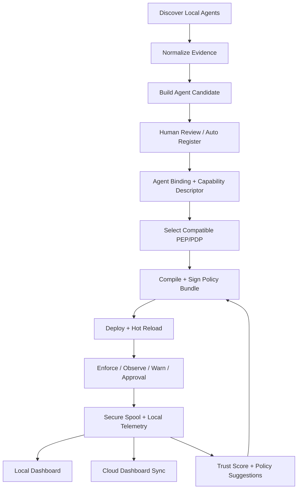

# POLLEK.AI Local Enforcement Kit

## Full Agent Governance Flow Implementation Plan

วันที่จัดทำ: 2026-06-24  
Repo: `https://github.com/AECInfraconnect/AntiG_Pollen_DEK`  
Target: `v1.0.0-beta.10` -> production-grade beta ที่ Agent Discovery, Registration, Policy Deploy, Enforcement และ Telemetry ทำงานจริงครบ flow

> หมายเหตุการตรวจ repo: ผู้ใช้ขอให้ใช้ GitHub tool; ได้ลองใช้ GitHub connector แล้ว แต่ connector ไม่พบ repo ใน installed repositories และ code search ผ่าน connector ไม่คืนผลลัพธ์ จึงใช้ GitHub public web/raw แทน นอกจากนี้ `git clone` ผ่าน terminal ถูก GitHub URL policy บล็อก 403 แม้ลอง escalation แล้ว จึงไม่ได้ run build/test ในเครื่องนี้ แผนนี้อิงจากไฟล์ GitHub web/raw ล่าสุด, README, Cargo workspace, architecture, CI workflow และ source files ที่เปิดได้โดยตรง

## 1. Executive Summary

Repo ล่าสุดของ POLLEK.AI Local Enforcement Kit มีโครงสร้างที่ดีมากสำหรับ open-source local AI policy runtime:

- README ระบุเป้าหมายชัดว่าเป็น local-first AI Agent Governance Runtime ที่ discover agents, deploy policy ไปยัง PEP ที่เหมาะสม, evaluate ผ่าน local/cloud PDP, เก็บ tamper-aware telemetry และแสดงผลใน dashboard
- มี 56 crates ตาม README ครอบคลุม control, decision, observability, network, identity, interop, SDK และ local/mock control plane
- มี module สำหรับ discovery หลายชนิดแล้ว: process, MCP config, local model probe, IDE extension, CLI agent, container, browser extension, web AI
- มี policy sync และ bundle sync ที่เริ่มมี behavior จริง: fail-closed freshness gate, JCS verify สำหรับ TUF metadata, anti-rollback, schema validation, SSE push, network guardrails fetch
- มี MCP proxy ที่ทำ auth, normalization, admission control, content guard, rate limit, trust gate, policy evaluation และ telemetry hook บางส่วนแล้ว

แต่ยังไม่ควรถือว่า "ทำงานจริงครบทุกฟังก์ชัน" เพราะยังมี stub/mock/optimistic detection หลายจุดที่มีผลต่อ flow สำคัญ:

| Area                 | Current Gap                                                                                           | Production Risk                                                       |
| -------------------- | ----------------------------------------------------------------------------------------------------- | --------------------------------------------------------------------- |
| Secure Spool         | `Spool::enqueue` ยัง no-op แม้มี `segment.rs` และ `audit.rs`                                          | telemetry/audit หายจาก runtime จริง                                   |
| Agent Observer       | `ingest_event` แค่ validate แล้ว `println!`                                                           | trust score, policy suggestion, dashboard observe ไม่ได้ใช้ข้อมูลจริง |
| Capability Registry  | WFP/macOS/eBPF capability detect จาก OS constant เป็นหลัก                                             | deploy policy ไป PEP ที่ enforce จริงไม่ได้                           |
| Discovery Aggregator | `device-local`, dummy port 80, risk score คงที่, registry agent capabilities ว่าง                     | register/control agent ไม่ครบและ match policy ไม่แม่น                 |
| MCP Proxy            | `input_hash = "mock_hash"`, `mock_trust score=1.0`, hard-coded telemetry endpoint/device ในบางจุด     | audit proof และ trust control ใช้งานจริงไม่ได้                        |
| Bundle Sync          | local mode signature path ยังไม่ได้ enforce JCS เหมือน cloud path และ rollback error มี approximation | signed policy และ rollback ยังไม่แข็งพอ                               |
| Stdio Control        | มี crate `dek-mcp-stdio-wrapper` แต่ต้องพิสูจน์ JSON-RPC framing/child lifecycle/end-to-end           | AI desktop agents ที่ใช้ stdio ยัง enforce ไม่ครบ                     |
| Dashboard Flow       | README claim 20+ pages แต่ต้อง bind กับ capability/registration/deploy result จริง                    | UI อาจแสดงว่า enforce แล้วทั้งที่ PEP เป็น observe-only               |

## 2. Target End-to-End Flow



Production invariant:

1. Discovery never auto-enforces. It produces evidence and candidates.
2. Registration creates durable registry objects with capabilities, entrypoints, identity hints and risk classification.
3. Binding maps each agent surface to concrete PEP candidates: MCP stdio wrapper, MCP HTTP proxy, OS network PEP, browser/IDE observe-only, SDK PEP.
4. Policy deploy validates PEP capability before activation.
5. Runtime applies requested `ControlLevel`: `observe`, `warn`, `approval`, `enforce`, `strict_deny`.
6. Every decision emits local telemetry first, then cloud sync if configured.
7. Dashboard shows actual status, not desired status.

## 3. Current Repo Evidence and Gap Notes

### 3.1 Repo and Architecture

GitHub page shows:

- Public repo with 373 commits
- Public-facing README name: `POLLEK.AI -- Open Source Local AI Policy Enforcement Kit`
- Local mode quickstart: `start-dek.ps1` and `start-dek.sh`, dashboard at `127.0.0.1:43891`
- Runtime port: MCP/forward proxy around `127.0.0.1:43890`
- Crate landscape includes `dek-agent-discovery`, `dek-agent-observer`, `dek-policy-suggester`, `dek-capability-registry`, `dek-agent-binding`, `dek-mcp-proxy`, `dek-mcp-stdio-wrapper`, `dek-secure-spool`, `local-control-plane`, `mock-cloud`

### 3.2 Agent Discovery

Files inspected:

- `crates/dek-agent-discovery/src/lib.rs`
- `process_scan.rs`
- `orchestrator.rs`
- `aggregator.rs`
- `api.rs`
- `mcp_scan.rs`
- `local_model_probe.rs`
- `container_scan.rs`
- `browser_scan.rs`
- `fingerprint.rs`

Good:

- `process_scan` uses `sysinfo`, collects pid, parent pid, process name, command template, start time and redacted/hash path data
- `orchestrator` already coordinates sources: process, MCP config, local model, IDE extension, CLI, container, browser extension, web AI
- `mcp_scan` reads known config paths and produces evidence
- `local_model_probe` detects Ollama and OpenAI-compatible local model endpoints
- `container_scan` detects Docker containers with AI/MCP-like image/name
- `browser_scan` inspects Chrome/Edge extension manifests

Needs production hardening:

- `fingerprint_process` gives any process-name signal `0.4`, which can over-detect generic `code`, `node`, `python`
- `aggregator` uses fixed `risk_score = 10`, `device_id = "device-local"`, dummy port 80 and empty `discovered_configs`
- `to_registry_agent_v2` creates registry `AiAgent` with `capabilities: vec![]` and `entrypoints: vec![]`, losing candidate evidence
- Docker scan has no timeout and no Podman/containerd support
- Browser scan reads only Default profile and includes raw-ish browser profile path in event data
- Local model probe uses fixed ports and no endpoint allowlist/configurable catalog

### 3.3 Capability Registry

File inspected:

- `crates/dek-capability-registry/src/lib.rs`

Good:

- Has `DeviceCapabilities`, `PdpCapability`, `PepCapability`, `PluginCapability`, `KernelCapabilities`
- Already has `ControlLevel`
- Has compatibility function that checks `pep.can_observe` and `pep.can_enforce`

Needs production hardening:

- `linux_ebpf`, `windows_wfp`, `macos_nefilter` are optimistic JSON based on OS constant rather than real probe
- Capability should include `status`, `mode`, `requires_admin`, `reason`, `min_os`, `probe_evidence`, `last_checked_at`
- `has_os_l4_ready()` should distinguish `observe_only` vs `enforce`

### 3.4 Agent Binding and Control

Files inspected:

- `crates/dek-agent-binding/src/binding.rs`
- `capability.rs`
- `control.rs`
- `enforce.rs`
- `telemetry.rs`

Good:

- `AgentBinding` models lifecycle: `Discovered`, `Provisioned`, `Enforced`, `Suspended`, `Deprovisioned`
- Control strategies include `StdioWrapperInjection`, `HttpProxyRedirect`, `NetworkEgressInterception`, `ObserveOnly`
- Enforcement derives tool guards from risk class
- Telemetry spec includes transport/tool/agentic layers and OTel-like attributes

Needs production hardening:

- Binding currently depends heavily on fingerprint definitions, while discovery candidate -> binding path is not fully wired
- `requires_approval` for stdio wrapper is currently false even though modifying MCP config should require explicit user consent
- HTTP proxy redirect uses query-string upstream URL, which can leak sensitive endpoint and create SSRF risks
- `probe_mcp_tools` only handles HTTP; stdio tools/list probing needs safe child process invocation
- `TelemetrySpec` endpoints drift: `/v1/telemetry/metrics` vs earlier `/v1/metrics`

### 3.5 Policy Sync and Bundle Deploy

Files inspected:

- `crates/dek-policy-syncer/src/lib.rs`
- `crates/dek-bundle-sync/src/lib.rs`

Good:

- `PolicySyncer` starts fail-closed with `startup_not_yet_synced`
- Has freshness gate, last sync, bundle expiry, status file, audit state change
- Fetches trusted keys and supports key rotation audit
- `BundleSyncAgent` verifies TUF-like metadata using JCS for signed metadata
- Has anti-rollback, schema validation and staged manifest write
- Supports local mode envelope `{ manifest, signatures }`

Needs production hardening:

- Local mode signature verification should canonicalize manifest using RFC 8785/JCS, not `serde_json::to_vec`
- Anti-rollback error returns approximate `current: 0` in one path
- Staging currently writes manifest file directly; should use temp dir + fsync + atomic rename
- Activation should warm OPA/Cedar/OpenFGA/WASM and run smoke tests before active
- Need deployment result table: requested, staged, active, lkg, failed, rollback

### 3.6 Enforcement Path

File inspected:

- `crates/dek-mcp-proxy/src/main.rs`

Good:

- Normalizes MCP HTTP input
- Requires bearer token
- Applies admission control/backpressure
- Applies content guard
- Applies rate limit
- Runs policy router
- Has hot reload watcher on active/shadow bundle
- Exposes `/mcp`, `/v1/authorize`, `/v1/evaluate`, `/v1/filter/request`, `/v1/filter/response`

Needs production hardening:

- `input_hash` is hard-coded as `"mock_hash"`
- trust score is hard-coded `score: 1.0`
- telemetry sink call should pass real tenant/device and secure spool
- forward proxy only handles CONNECT and does not show full egress policy decision in inspected lines
- hot reload should be driven by activation state machine, not only filesystem watcher
- route aliases should align with Contract Hub

### 3.7 Secure Spool and Telemetry

Files inspected:

- `crates/dek-secure-spool/src/lib.rs`
- `segment.rs`
- `audit.rs`
- `crates/dek-telemetry/src/lib.rs`
- `crates/dek-agent-observer/src/ingest.rs`
- `trust.rs`

Good:

- `segment.rs` already supports encrypted records with `PDS1` magic, version, CRC32C, frame size checks
- `audit.rs` has tamper-evident hash chain
- `dek-telemetry` has SQLite spooler, redactor, retry, routing and fallback
- `trust.rs` can build baseline from observations and derive `Normal`, `RequireApproval`, `KillSwitch`

Needs production hardening:

- `Spool::enqueue` is no-op and must wire to segment writer
- `ingest_event` is stub and must persist to observation store
- Heartbeat uses hard-coded `device_id = "dek-device-01"`
- Need one telemetry pipeline decision: SQLite spooler vs secure segment spool, or layer them intentionally
- Trust store must be persisted and queried by MCP proxy before decision

## 4. Production Flow Requirements

### 4.1 Agent Discovery Sources

| Source             | Goal                                                                 | Required Implementation                                                        |
| ------------------ | -------------------------------------------------------------------- | ------------------------------------------------------------------------------ |
| Process scan       | Find running agent processes                                         | sysinfo + signer/hash + parent tree + command redaction + known binary catalog |
| MCP config scan    | Find MCP servers from Claude/Cursor/Windsurf/VS Code configs         | parse JSON/TOML/YAML, detect stdio/http/sse, compute reversible config patch   |
| MCP runtime probe  | Extract `tools/list` capabilities                                    | HTTP/SSE probe and safe stdio child probe with timeout                         |
| Local model server | Detect Ollama, LM Studio, vLLM, llama.cpp, OpenAI-compatible servers | configurable port catalog + `/api/tags`, `/v1/models`, health probes           |
| IDE extensions     | Cursor, VS Code, JetBrains, Zed, Windsurf                            | extension registry paths + manifest/package.json parse                         |
| Browser extensions | Chrome, Edge, Firefox profiles                                       | all profiles, manifest parse, allowlist/denylist, opt-in by default            |
| Containers         | Docker, Podman, containerd                                           | timeout command runner, labels, exposed ports, image signatures if possible    |
| Web AI             | Browser SNI/egress observations                                      | use network telemetry and never capture prompts by default                     |
| Network egress     | Discover AI APIs in use                                              | DNS/SNI/IP metadata only, map to provider catalog                              |

### 4.2 Agent Registration

Registration object must preserve:

- Agent identity: stable `agent_id`, `agent_instance_id`, process path hash, signer fingerprint, optional SPIFFE ID
- Runtime: desktop app, IDE plugin, browser extension, CLI, MCP server, local model server, container
- Entry points: stdio command, HTTP endpoint, SSE endpoint, OpenAI-compatible endpoint
- Declared tools: MCP `tools/list` name/schema/risk
- Data reach: file paths, env vars, browser profile, local ports, cloud egress hosts
- Control bindings: PEP strategies and reversibility
- Observation profile: what telemetry is allowed
- Approval state: discovered, pending approval, registered, suspended, deprovisioned

### 4.3 PEP Selection

| Agent Surface                  | Preferred PEP                                        | Control Level                                  |
| ------------------------------ | ---------------------------------------------------- | ---------------------------------------------- |
| MCP stdio                      | `dek-mcp-stdio-wrapper` with reversible config patch | observe/warn/approval/enforce                  |
| MCP HTTP/SSE                   | local MCP proxy / reverse proxy                      | observe/warn/approval/enforce                  |
| OpenAI-compatible local server | HTTP proxy or OS egress guard                        | observe/warn/enforce                           |
| Local desktop app no MCP       | OS network PEP + process observer                    | observe/warn/enforce only if OS PEP ready      |
| Browser extension              | browser/profile observer + network metadata          | observe/warn initially                         |
| Container model server         | Docker/Podman metadata + network PEP                 | observe/enforce if local proxy or OS PEP ready |
| Unknown process                | process/network observe                              | observe only until approved                    |

### 4.4 Control Levels

| Level         | Behavior                                                                         |
| ------------- | -------------------------------------------------------------------------------- |
| `observe`     | allow traffic/tool call, record telemetry                                        |
| `warn`        | allow but emit warning/alert                                                     |
| `approval`    | pause/deny with obligation requiring human approval                              |
| `enforce`     | allow/deny/redact/rate-limit according to policy                                 |
| `strict_deny` | deny when bundle invalid/stale, SVID invalid, capability mismatch or kill-switch |

## 5. Implementation Plan

### Phase A: Source Hygiene and Test Harness

Priority: P0

Why:

- Many raw files are shown as one-line files. Even if GitHub UI preserves logic, it makes review, diffs and line-level debugging poor.

Tasks:

- Run `cargo fmt --all`
- Run formatter for YAML/TS/TSX
- Add `actionlint`
- Add CI guard for accidental one-line source files
- Add local full-flow test fixtures under `tests/fixtures/agent-governance`

Acceptance:

- `cargo fmt --all -- --check` passes
- GitHub workflows parse with `actionlint`
- Generated files are excluded; hand-written files must be readable

### Phase B: Discovery Evidence Normalization

Priority: P0

Files:

- `crates/dek-agent-discovery/src/model.rs`
- `process_scan.rs`
- `mcp_scan.rs`
- `local_model_probe.rs`
- `container_scan.rs`
- `browser_scan.rs`
- `aggregator.rs`

Target data model:

```rust
#[derive(Debug, Clone, Serialize, Deserialize)]
pub struct DiscoveryEvidenceV3 {
    pub evidence_id: String,
    pub tenant_id: String,
    pub device_id: String,
    pub source: EvidenceSource,
    pub observed_at: String,
    pub confidence: f64,
    pub privacy_class: PrivacyClass,
    pub redacted: bool,
    pub subject: EvidenceSubject,
    pub signals: Vec<DiscoverySignal>,
    pub raw_redacted: serde_json::Value,
    pub merge_key: String,
}

#[derive(Debug, Clone, Serialize, Deserialize)]
#[serde(tag = "kind", rename_all = "snake_case")]
pub enum EvidenceSubject {
    Process { pid: u32, process_name: String, exe_hash: Option<String> },
    McpServer { server_name: String, transport: String, config_hash: Option<String> },
    HttpEndpoint { url_redacted: String, port: u16, protocol: String },
    BrowserExtension { browser: String, profile_hash: String, extension_id: String },
    Container { engine: String, container_id_hash: String, image: String },
}

#[derive(Debug, Clone, Serialize, Deserialize)]
pub struct DiscoverySignal {
    pub name: String,
    pub weight: f64,
    pub source: String,
    pub reason: String,
}
```

Implementation notes:

- Replace fixed `risk_score = 10` with weighted scoring from process signer, known catalog, MCP config, tools/list, network egress and user approval
- Replace `device-local` with real device id from `dek-config`
- Remove dummy port 80; derive actual observed port from endpoint
- Store raw paths only as hashes/redacted UI strings
- Add `DiscoveryScanJob` persistent status and evidence count

Acceptance tests:

- `process_scan_redacts_paths_and_args`
- `mcp_config_merges_with_process_candidate`
- `local_model_probe_records_actual_port`
- `browser_scan_never_stores_raw_home_path`
- `container_scan_times_out_without_hanging`

### Phase C: Fingerprint Catalog and Confidence Engine

Priority: P0

Files:

- `crates/dek-fingerprint-defs`
- `crates/dek-agent-discovery/src/fingerprint.rs`
- `crates/dek-agent-discovery/src/source_catalog.rs`

Problem:

- Current `fingerprint_process` gives 0.4 to any process name, which is too broad.

Target:

- Create signed offline baseline definitions + delta updates
- Use weighted signals and thresholds:
  - process name exact/regex
  - binary hash
  - executable signer
  - MCP config path
  - MCP tools/list result
  - local model endpoint
  - egress host catalog
  - container image/label

Example:

```rust
pub fn confidence_from_signals(signals: &[DiscoverySignal]) -> f64 {
    let weighted: f64 = signals.iter().map(|s| s.weight.max(0.0)).sum();
    let capped = weighted.min(1.0);

    let has_strong = signals.iter().any(|s| {
        matches!(s.name.as_str(), "binary_hash" | "mcp_config" | "tools_list" | "executable_signer")
    });

    if has_strong { capped } else { capped.min(0.55) }
}
```

Acceptance:

- Generic `node`, `python`, `code` alone cannot become registered AI agent
- Known `Claude Desktop + mcp_config` becomes high-confidence candidate
- Fingerprint definitions are signature verified before import

### Phase D: Capability Registry Real Probe

Priority: P0

Files:

- `crates/dek-capability-registry/src/lib.rs`
- `crates/dek-capability-registry/src/detect.rs`
- `crates/dek-core/src/capabilities.rs`

Current issue:

- Kernel capabilities are inferred from OS string.

Target model:

```rust
#[derive(Debug, Clone, Serialize, Deserialize, PartialEq)]
#[serde(rename_all = "snake_case")]
pub enum CapabilityStatus {
    Available,
    ObserveOnly,
    Preview,
    Unsupported,
    Degraded,
    PermissionRequired,
}

#[derive(Debug, Clone, Serialize, Deserialize)]
pub struct PepRuntimeCapability {
    pub pep_type: String,
    pub transports: Vec<String>,
    pub control_level_max: ControlLevel,
    pub status: CapabilityStatus,
    pub can_observe: bool,
    pub can_enforce: bool,
    pub requires_admin: bool,
    pub reason: Option<String>,
    pub probe_evidence: serde_json::Value,
}
```

Probe rules:

- Linux eBPF:
  - check kernel version
  - check `/sys/fs/bpf` access
  - check cgroup v2
  - check CAP_BPF/CAP_SYS_ADMIN where relevant
  - test map pin/create in dry run if permitted
- Windows WFP:
  - minimum target: Windows 10 22H2+ / Windows 11 / Server 2019+
  - check admin
  - check BFE service running
  - user-mode filter available -> observe/proxy
  - signed callout driver installed -> enforce
- macOS NetworkExtension:
  - check macOS version
  - check system extension installed/approved
  - check NetworkExtension entitlement
  - without approval -> observe_only/permission_required

Acceptance:

- Dashboard cannot deploy `enforce` to `observe_only`
- `capability registry` output is stable and versioned
- Every PEP reports reason when unsupported/degraded

### Phase E: Register Agent and Binding Store

Priority: P0

Files:

- `crates/dek-agent-discovery/src/api.rs`
- `crates/dek-agent-binding`
- `crates/local-control-plane/src/*registry*`
- `crates/dek-agent-observer/src/binding_store.rs`

Target:

- `to_registry_agent_v2` must map candidate entrypoints/capabilities into `AiAgent`
- Add durable `AgentBindingStore` in SQLite/local-control-plane
- Registration should be idempotent using stable fingerprint key

Example stable key:

```rust
pub fn stable_agent_key(candidate: &DiscoveredAgentCandidateV2) -> String {
    let mut parts = vec![
        candidate.tenant_id.clone(),
        candidate.device_id.clone(),
        format!("{:?}", candidate.inferred_agent_type),
        candidate.display_name.to_ascii_lowercase(),
    ];

    if let Some(hash) = candidate
        .evidence
        .iter()
        .find_map(|e| e.source_path_hash.clone())
    {
        parts.push(hash);
    }

    let joined = parts.join("|");
    format!("agent_{}", sha256_short(&joined))
}
```

Registration states:

```text
discovered -> pending_approval -> registered -> provisioned -> enforced
                                     |             |
                                     v             v
                                  suspended    deprovisioned
```

Acceptance:

- Re-running scan does not duplicate same agent
- Registered agent preserves MCP servers, endpoints and tool capabilities
- User can suspend/deprovision and all control bindings reverse cleanly

### Phase F: MCP Tool Capability Probe

Priority: P0

Files:

- `crates/dek-agent-binding/src/capability.rs`
- `crates/dek-mcp-stdio-wrapper`
- `crates/dek-mcp-normalizer`

Target:

- HTTP/SSE `tools/list`
- Stdio `initialize` + `tools/list` through sandboxed child process with timeout
- Never execute tool calls during probing

Example stdio probe:

```rust
pub async fn probe_stdio_tools(command: &[String], timeout: Duration) -> anyhow::Result<Vec<ToolCapability>> {
    let mut child = tokio::process::Command::new(&command[0])
        .args(&command[1..])
        .stdin(std::process::Stdio::piped())
        .stdout(std::process::Stdio::piped())
        .stderr(std::process::Stdio::null())
        .kill_on_drop(true)
        .spawn()?;

    let mut stdin = child.stdin.take().context("missing child stdin")?;
    let stdout = child.stdout.take().context("missing child stdout")?;

    let initialize = serde_json::json!({
        "jsonrpc": "2.0",
        "id": 1,
        "method": "initialize",
        "params": {
            "protocolVersion": "2025-06-18",
            "capabilities": {},
            "clientInfo": { "name": "pollek-prober", "version": "1.0" }
        }
    });

    let list = serde_json::json!({
        "jsonrpc": "2.0",
        "id": 2,
        "method": "tools/list",
        "params": {}
    });

    tokio::time::timeout(timeout, async {
        use tokio::io::AsyncWriteExt;
        stdin.write_all(format!("{}\n{}\n", initialize, list).as_bytes()).await?;
        parse_tools_from_stdout(stdout).await
    }).await?
}
```

Acceptance:

- Timeout kills child process
- Malformed JSON-RPC does not crash
- Tool schema is stored and risk classified

### Phase G: PEP Selection and Control Binding Planner

Priority: P0

Files:

- `crates/dek-agent-binding/src/control.rs`
- `crates/dek-policy-presets`
- `crates/local-control-plane`

Target:

- Convert candidate/binding/capability into deployable PEP plan
- Plan must be reversible and approval-aware
- Stdio config changes must require explicit approval

Example:

```rust
pub fn plan_control_binding(
    agent: &RegisteredAgent,
    caps: &DeviceCapabilities,
    requested: ControlLevel,
) -> Vec<ControlBindingPlan> {
    agent.surfaces.iter().filter_map(|surface| match surface {
        AgentSurface::McpStdio { config_hash, server_name } => Some(ControlBindingPlan {
            pep_type: "mcp_stdio_wrapper".into(),
            target: server_name.clone(),
            action: "wrap_config".into(),
            requested_level: requested.clone(),
            max_supported_level: ControlLevel::Enforce,
            requires_user_approval: true,
            reversible: true,
            config_hash: Some(config_hash.clone()),
        }),
        AgentSurface::McpHttp { endpoint } if caps.supports_enforce("mcp_http_proxy") => {
            Some(ControlBindingPlan {
                pep_type: "mcp_http_proxy".into(),
                target: endpoint.clone(),
                action: "proxy_redirect".into(),
                requested_level: requested.clone(),
                max_supported_level: ControlLevel::Enforce,
                requires_user_approval: false,
                reversible: true,
                config_hash: None,
            })
        }
        AgentSurface::NetworkEgress { .. } if caps.supports_enforce("os_network") => {
            Some(ControlBindingPlan::network_enforce(surface, requested.clone()))
        }
        _ => Some(ControlBindingPlan::observe_only(surface)),
    }).collect()
}
```

Acceptance:

- If local machine has no OS PEP, network policy becomes observe/warn, not enforce
- Dashboard shows exact reason for downgraded control level
- Config patch has backup and rollback path

### Phase H: Policy Deploy to Correct PEP

Priority: P0

Files:

- `crates/dek-policy-presets`
- `crates/dek-policy-compiler`
- `crates/dek-bundle-format`
- `crates/dek-bundle-sync`
- `crates/dek-activation`
- `crates/dek-policy-syncer`

Target deploy flow:

```text
draft policy -> compile -> validate against capabilities -> sign envelope
-> stage bundle -> warm engines/plugins -> smoke test -> activate
-> notify PEP -> emit deployment result
```

Bundle deploy result:

```rust
#[derive(Debug, Clone, Serialize, Deserialize)]
pub struct DeploymentResult {
    pub deployment_id: String,
    pub tenant_id: String,
    pub device_id: String,
    pub policy_id: String,
    pub requested_control_level: ControlLevel,
    pub effective_control_level: ControlLevel,
    pub target_peps: Vec<String>,
    pub status: DeploymentStatus,
    pub downgraded_reason: Option<String>,
    pub activated_bundle_version: Option<String>,
    pub rollback_bundle_version: Option<String>,
}
```

Critical fixes:

- Use RFC 8785/JCS canonicalization in local mode envelope verification
- Replace direct file write with atomic temp dir activation
- Rollback manager must return accurate current/incoming versions
- Add activation smoke:
  - OPA WASM loads
  - Cedar policy parses
  - OpenFGA model/tuples validate
  - MCP deny/allow sample evaluates

Acceptance:

- Invalid signature never activates
- Capability mismatch blocks deploy or downgrades with explicit result
- Active bundle reload is atomic
- LKG rollback works after failed smoke test

### Phase I: Enforcement Runtime Integration

Priority: P0

Files:

- `crates/dek-mcp-proxy`
- `crates/dek-mcp-stdio-wrapper`
- `crates/dek-policy-router`
- `crates/dek-agent-observer`
- `crates/dek-secure-spool`

Critical fixes:

- Replace `input_hash = "mock_hash"` with canonical hash
- Replace mock trust with persisted trust lookup
- Apply obligations consistently:
  - deny
  - allow
  - redact fields
  - require approval
  - rate limit
  - strict deny
- Every decision emits:
  - decision event
  - observation event
  - audit event
  - metric

Example decision hash:

```rust
pub fn decision_input_hash(input: &serde_json::Value) -> anyhow::Result<String> {
    let canonical = serde_jcs::to_vec(input)?;
    Ok(format!("sha256:{}", hex::encode(sha2::Sha256::digest(canonical))))
}
```

Example trust integration:

```rust
pub async fn enforce_agent_trust(
    trust_store: &dyn TrustStore,
    agent_id: &str,
) -> dek_agent_observer::trust::TrustAction {
    match trust_store.current_score(agent_id).await {
        Ok(score) => dek_agent_observer::trust::enforce_trust(&score),
        Err(_) => dek_agent_observer::trust::TrustAction::RequireApproval,
    }
}
```

Acceptance:

- MCP HTTP deny returns JSON-RPC error and does not forward call
- MCP stdio deny prevents child server call
- Redact obligation changes only configured fields
- Approval mode is visible in dashboard
- Strict deny activates when policy freshness gate requires it

### Phase J: Secure Spool Wire-Up

Priority: P0

Files:

- `crates/dek-secure-spool/src/lib.rs`
- `segment.rs`
- `crypto.rs`
- `key_manager.rs`
- `os/*`
- `crates/dek-telemetry`
- `crates/dek-agent-observer`

Target:

- `Spool::enqueue` must persist encrypted segment record
- Use OS key store:
  - Windows: DPAPI, LocalMachine for service, CurrentUser for user profile
  - macOS: Keychain Services
  - Linux: Kernel Keyring for daemon; fallback encrypted file with strict permissions
- Maintain replay cursor
- Support priorities
- Support quarantine of corrupted segment

Example facade:

```rust
pub struct Spool {
    writer: tokio::sync::Mutex<segment::SegmentWriter>,
    key: crypto::AeadKey,
}

impl Spool {
    pub async fn enqueue(&self, data: Vec<u8>) -> Result<(), SpoolError> {
        let event: segment::TelemetryEvent = serde_json::from_slice(&data)?;
        let mut writer = self.writer.lock().await;
        writer.append_event(&self.key, &event)?;
        Ok(())
    }
}
```

Acceptance:

- Event survives process restart
- Tamper is detected
- Offline replay does not duplicate after ack
- Disk-full returns backpressure error

### Phase K: Agent Observer and Trust Store

Priority: P0

Files:

- `crates/dek-agent-observer/src/ingest.rs`
- `binding_store.rs`
- `trust.rs`
- `cost.rs`
- `aggregate.rs`

Target:

- Replace `println!` stub with persisted observation store
- Maintain per-agent baseline
- Trust score query API for MCP proxy
- Cost ledger query API for dashboard
- Drift detection: new tool, new endpoint, unusual deny rate, unusual cost

Example trait:

```rust
#[async_trait::async_trait]
pub trait ObservationStore: Send + Sync {
    async fn append(&self, event: AgentObservationEvent) -> Result<(), ObserverError>;
    async fn recent_for_agent(&self, agent_id: &str, limit: u32) -> Result<Vec<AgentObservationEvent>, ObserverError>;
    async fn update_baseline(&self, agent_id: &str) -> Result<TrustScore, ObserverError>;
}
```

Acceptance:

- `ingest_event` writes to store and secure spool
- Trust score changes after deny spikes
- Policy suggester can read real observations
- Dashboard cost/trust pages show persisted data

### Phase L: Local and Cloud Dashboard Telemetry

Priority: P1

Files:

- `crates/dek-telemetry`
- `crates/local-control-plane`
- `apps/local-admin-dashboard`
- `contracts/spec`

Target:

- One canonical telemetry envelope
- Local dashboard reads from local store
- Cloud sync uses batching, retry, redaction and tenant/device identity
- GenAI/MCP OTel attributes follow OpenTelemetry GenAI conventions

Canonical event:

```json
{
  "schema_version": "pollek.telemetry.event.v1",
  "event_id": "evt_...",
  "tenant_id": "local",
  "device_id": "dev_...",
  "agent_id": "agent_...",
  "binding_id": "bind_...",
  "event_type": "mcp.decision",
  "control_level": "enforce",
  "decision": "deny",
  "reason": "policy:pii_egress_block",
  "input_hash": "sha256:...",
  "redacted": true,
  "observed_at": "2026-06-24T00:00:00Z",
  "attributes": {
    "gen_ai.system": "openai",
    "gen_ai.agent.id": "agent_...",
    "mcp.tool.name": "filesystem.write"
  }
}
```

Acceptance:

- No raw prompt/body by default
- Local dashboard works offline
- Cloud sync can resume after network outage
- `/v1/metrics` and `/v1/telemetry/metrics` drift is resolved by alias and contract update

### Phase M: Dashboard UX for Real Control

Priority: P1

Files:

- `apps/local-admin-dashboard`
- `crates/local-control-plane`

Required screens:

| Screen            | Required Behavior                                           |
| ----------------- | ----------------------------------------------------------- |
| Auto Discovery    | run scan, show sources, confidence, evidence, privacy class |
| Candidate Review  | approve/register/suspend, inspect capabilities              |
| Agent Registry    | status, trust, entrypoints, control bindings                |
| Capability Matrix | OS/PDP/PEP support with real status and reason              |
| Policy Presets    | filter by compatible PEP/PDP/control level                  |
| Deployment Result | show effective control level and downgrade reason           |
| Decision Logs     | search, export CSV/JSON, hash verification                  |
| Telemetry         | queue depth, local/cloud sync, replay failures              |

Acceptance:

- UI never says `Enforced` unless PEP confirms active binding
- Preview modules display warning
- Every user-facing action has reversible/rollback status

## 6. API Contract Additions

### 6.1 Discovery

```http
POST /v1/discovery/scans
GET  /v1/discovery/scans/{scan_id}
GET  /v1/discovery/candidates
GET  /v1/discovery/candidates/{candidate_id}
POST /v1/discovery/candidates/{candidate_id}/register
```

### 6.2 Capabilities

```http
GET  /v1/device/capabilities
POST /v1/device/capabilities/probe
GET  /v1/device/capabilities/history
```

### 6.3 Agent Binding

```http
GET  /v1/agents
GET  /v1/agents/{agent_id}
POST /v1/agents/{agent_id}/bindings/plan
POST /v1/agents/{agent_id}/bindings/apply
POST /v1/agents/{agent_id}/suspend
POST /v1/agents/{agent_id}/deprovision
```

### 6.4 Policy Deploy

```http
POST /v1/policies/drafts
POST /v1/policies/{policy_id}/simulate
POST /v1/policies/{policy_id}/deploy
GET  /v1/deployments/{deployment_id}
POST /v1/deployments/{deployment_id}/rollback
```

### 6.5 Telemetry

```http
POST /v1/telemetry/events
GET  /v1/telemetry/events
GET  /v1/telemetry/metrics
GET  /v1/metrics
GET  /v1/telemetry/spool/status
POST /v1/telemetry/spool/replay
```

## 7. AI Agent Backlog

### PR-001: Format and Full-Flow Test Scaffolding

- Format all Rust/YAML/TS files
- Add source shape CI
- Add flow fixtures
- Add `cargo test -p acceptance-tests agent_governance_flow`

### PR-002: Discovery V3 Evidence and Aggregator

- Implement `DiscoveryEvidenceV3`
- Replace dummy `device-local`, dummy port and fixed risk
- Add stable candidate merge key
- Persist scan job/evidence/candidates

### PR-003: Fingerprint Catalog and Safe Confidence

- Weighted fingerprint catalog
- Signature verification for definitions
- Remove broad detection from generic `node/python/code`

### PR-004: Real Capability Registry

- Real probes for Linux eBPF, Windows WFP, macOS NetworkExtension
- Add status/reason/permission fields
- Dashboard capability matrix

### PR-005: Registration and Binding Store

- Candidate -> registered agent mapping with entrypoints/capabilities
- Durable binding lifecycle
- Idempotent register

### PR-006: MCP Tool Probe for HTTP and Stdio

- HTTP/SSE tools/list
- Stdio initialize/tools-list probe with timeout
- Store tool schemas and risk classes

### PR-007: Control Binding Planner

- Plan PEP by surface/capability/control level
- Require approval for config patch
- Reversible config backup

### PR-008: Policy Deploy and Activation State Machine

- JCS local envelope verify
- Atomic stage/warm/smoke/activate
- Accurate rollback state
- Deployment result API

### PR-009: MCP Enforcement Completion

- Real `input_hash`
- Real trust lookup
- Consistent obligation application
- Decision telemetry for every path

### PR-010: Secure Spool Facade

- Wire `Spool::enqueue`
- Replay cursor
- OS key store
- Tamper/quarantine tests

### PR-011: Observer Persistence and Trust Score

- Replace `println!` ingest
- SQLite/RocksDB store
- Baseline/trust/cost/drift query API

### PR-012: Local/Cloud Telemetry Contract

- One envelope
- Metrics alias
- OTel GenAI/MCP attributes
- Dashboard queue/sync state

### PR-013: Dashboard Real-Control UX

- Candidate review
- Agent registry
- Capability matrix
- Deployment result
- Decision log verification

## 8. Acceptance Test Suite

### Local Full Flow

```text
1. Start local-control-plane
2. Start dek-core/dek-mcp-proxy
3. Run discovery scan with fixture MCP config
4. Candidate appears with process + mcp_config evidence
5. Register candidate
6. Probe tools/list
7. Capability registry reports stdio wrapper enforce available
8. Deploy preset "require approval for write/exec tools"
9. Apply stdio wrapper binding
10. Send tools/call write request
11. Request is blocked or approval-required
12. Decision appears in secure spool
13. Local dashboard shows decision and binding status
14. Cloud sync mock receives redacted event
```

### Failure Flow

```text
1. Deploy invalid signature bundle -> rejected
2. Stop cloud/mock endpoint -> local telemetry queues
3. Corrupt spool segment -> verification detects and quarantines
4. Expire bundle -> strict_deny gate blocks enforcement
5. Restore valid bundle -> active state resumes
```

### Cross Platform Capability

```text
Windows 10/11:
  - WFP probe reports enforce only if admin + signed driver/callout installed
  - Otherwise observe_only/permission_required

macOS:
  - NetworkExtension enforce only if system extension approved
  - Otherwise observe_only/permission_required

Linux:
  - eBPF enforce only if cgroup/BPF map probe succeeds
  - Otherwise user-mode proxy or observe_only
```

## 9. Performance and Reliability Targets

| Metric                          |                                          Target |
| ------------------------------- | ----------------------------------------------: |
| Discovery scan baseline         | < 5 seconds without container/browser deep scan |
| MCP decision p95 local          |                                         < 10 ms |
| MCP stdio wrapper overhead      |                                     < 15 ms p95 |
| Secure spool enqueue            |                                      < 5 ms p95 |
| Policy hot reload               |                                        < 500 ms |
| Local dashboard first load      |                                     < 2 seconds |
| Memory idle minimal             |                                         < 80 MB |
| Memory desktop profile          |                                        < 180 MB |
| Telemetry replay duplicate rate |                                               0 |
| Crash-free decision path        |                             99.9%+ in beta test |

## 10. Deep Research References

Primary references:

- MCP tools specification: `https://modelcontextprotocol.io/specification/2025-06-18/server/tools`
- MCP official repo/spec schema: `https://github.com/modelcontextprotocol/modelcontextprotocol`
- JSON-RPC 2.0: `https://www.jsonrpc.org/specification`
- OpenTelemetry GenAI conventions: `https://opentelemetry.io/docs/specs/semconv/gen-ai/`
- OpenTelemetry GenAI repository: `https://github.com/open-telemetry/semantic-conventions-genai`
- Windows Filtering Platform callout drivers: `https://learn.microsoft.com/en-us/windows-hardware/drivers/network/introduction-to-windows-filtering-platform-callout-drivers`
- Windows Filtering Platform architecture: `https://learn.microsoft.com/en-us/windows-hardware/drivers/network/windows-filtering-platform-architecture-overview`
- Apple NetworkExtension: `https://developer.apple.com/documentation/NetworkExtension`
- Apple Content Filter Providers: `https://developer.apple.com/documentation/networkextension/content-filter-providers`
- OPA WebAssembly: `https://openpolicyagent.org/docs/wasm`
- Cedar authorization: `https://docs.cedarpolicy.com/auth/authorization.html`
- OpenFGA Check API: `https://openfga.dev/docs/getting-started/perform-check`
- OpenFGA tuple/API best practices: `https://openfga.dev/docs/getting-started/tuples-api-best-practices`
- Wasmtime interruption/fuel: `https://docs.wasmtime.dev/examples-interrupting-wasm.html`
- Wasmtime ResourceLimiter: `https://docs.rs/wasmtime/latest/wasmtime/trait.ResourceLimiter.html`

## 11. Recommended Build Order

ทำตามลำดับนี้จะลดความเสี่ยงที่สุด:

1. PR-001 ถึง PR-004: ทำฐาน discovery/capability ให้เชื่อถือได้
2. PR-005 ถึง PR-007: ทำ registration/binding/control plan
3. PR-008 ถึง PR-010: ทำ deploy/enforce/spool ให้ production จริง
4. PR-011 ถึง PR-013: ทำ observe/trust/dashboard/cloud feedback loop

หลังครบชุดนี้ ระบบจะสามารถสาธิตและใช้งานจริงได้ครบวงจร:

```text
Discover -> Review -> Register -> Bind -> Deploy -> Enforce -> Observe -> Suggest -> Redeploy
```
