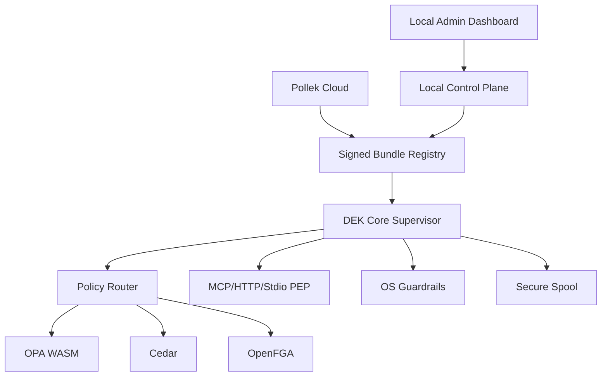

# POLLEK.AI Local Enforcement Kit

## Repo Audit and Production Implementation Plan

วันที่จัดทำ: 2026-06-23  
Repo: `https://github.com/AECInfraconnect/AntiG_Pollen_DEK`  
Target: `v1.0.0-beta.10` ไปสู่ beta ที่ติดตั้งง่าย ใช้งานจริงได้ และพิสูจน์คุณภาพด้วย CI/CD

> หมายเหตุ: ใน environment นี้ไม่สามารถ `git clone` หรือ download GitHub archive/raw ผ่าน terminal ได้เนื่องจากถูกปิด 403 จึงวิเคราะห์จาก GitHub web/raw, repository index, README, architecture, Cargo workspace, CI workflow raw และ context การออกแบบก่อนหน้า ไม่ได้ run `cargo test` หรือ build binary จริงในเครื่องนี้

## 1. Executive Summary

Repo ล่าสุดมี maturity ทางสถาปัตยกรรมสูงมากเมื่อเทียบกับ beta ทั่วไป: มี Rust workspace ขนาดใหญ่, Local Admin Dashboard, Local Control Plane, Mock Cloud, Contract Hub, release pipeline, SBOM, cosign, attestations, policy router, eBPF/WFP/macOS network modules, MCP proxy, stdio wrapper, plugin SDK และ governance loop

แต่เพื่อให้ "ทำงานจริงได้ทุกฟังก์ชันตามวัตถุประสงค์" ต้องแก้ 6 เรื่องก่อนเพิ่ม feature ใหม่:

1. **ทำให้ source และ CI เป็นรูปแบบที่ compile/review ได้จริง**  
   Raw files หลายไฟล์ที่ตรวจพบเป็นบรรทัดเดียว เช่น `crates/dek-core/src/main.rs`, `crates/local-control-plane/src/main.rs`, `crates/dek-policy-router/src/lib.rs`, `.github/workflows/*.yml` ถ้า raw snapshot นี้ตรงกับ repo จริง ต้องจัด format ใหม่ทันที โดยเฉพาะ YAML เพราะ workflow แบบ one-line มีความเสี่ยงไม่ถูก parse ตาม intent

2. **แทนที่ stub/no-op ด้วย implementation จริง**  
   ตัวอย่างชัดคือ `dek-secure-spool::Spool::enqueue` ที่ยัง return `Ok(())` โดยไม่ persist telemetry/audit จริง ทั้งที่ README ระบุว่า secure asynchronous feed และ tamper-evident audit เป็น feature หลัก

3. **แยกฟังก์ชัน production-ready ออกจาก preview ให้ชัด**  
   `A2A mediator`, `execution sandbox`, Windows WFP, macOS NetworkExtension, policy suggestion และ OS discovery ควรมี capability registry ที่บอกสถานะจริง: `available`, `observe_only`, `preview`, `unsupported`, `requires_permission`, `degraded`

4. **ทำ release gate ที่พิสูจน์ runtime behavior ไม่ใช่แค่ build ผ่าน**  
   ต้องมี E2E ที่ติดตั้ง artifact, start local control plane, deploy signed bundle, enforce MCP/HTTP/stdio, simulate policy reload, simulate spool offline, simulate rollback, verify metrics/logs

5. **ลด package footprint และ startup overhead ด้วย feature-gated builds**  
   ตอนนี้ workspace มี 50+ crates และ release build รวมหลาย binary ควรมี build profiles: `minimal`, `desktop`, `gateway`, `full`, `dev` เพื่อให้ download/install เร็วและ memory เหมาะกับ use case

6. **ทำ contract และ branding consistency**  
   README เปลี่ยน public-facing เป็น `POLLEK.AI` และ `Local Enforcement Kit` แต่ repo/crates/API ยังใช้ `dek-*`, `pollen-*`, `ai.pollen.dek` ผสมกัน ต้องกำหนด canonical names ไม่ให้ cloud/local contract drift

## 2. Current Repo Snapshot

ข้อมูลจาก GitHub page ล่าสุด:

| รายการ          | สถานะที่พบ                                                                                                                                                                     |
| --------------- | ------------------------------------------------------------------------------------------------------------------------------------------------------------------------------ |
| Repo visibility | Public                                                                                                                                                                         |
| Commits         | 373 commits                                                                                                                                                                    |
| Current version | `1.0.0-beta.10` ใน workspace package                                                                                                                                           |
| License         | Apache-2.0                                                                                                                                                                     |
| Languages       | Rust ประมาณ 63%, HTML ประมาณ 21%, TypeScript ประมาณ 12%, TypeSpec, Swift, PowerShell                                                                                           |
| Root folders    | `.github`, `apps`, `assets`, `contracts`, `crates`, `deploy`, `docs`, `examples`, `fuzz`, `load_tests`, `packaging`, `plugins`, `schemas`, `scripts`, `tests`, `ui/mock-cloud` |
| Core claims     | Local-first PEP/PDP, MCP/API/tool enforcement, signed bundles, dashboard, mock cloud, shadow AI discovery, secure spool, policy suggestions, eBPF/WFP/macOS modules            |
| Cargo workspace | `crates/*`, `plugins/*`, generated contract Rust crate, `examples/plugin-hello-world`                                                                                          |
| CI workflows    | CI, contract, coverage, dashboard, docs, fuzz, integration, local-admin-e2e, package, release, release-gate, schema-contract, scorecard, security                              |

## 3. Architecture Readiness

### 3.1 Intended Runtime Architecture



### 3.2 Strengths

- `Cargo.toml` มี workspace lint ที่ดี: `unsafe_code=deny`, `unused_must_use=deny`, clippy deny `unwrap_used`, `expect_used`, `panic`, `todo`, `unimplemented`, `dbg_macro`, `print_stdout`, `print_stderr`
- Release profile ตั้งใจ optimize แล้ว: `lto="fat"`, `codegen-units=1`, `opt-level=3`, `panic="abort"`, `strip=true`
- มี `mimalloc` ใน `dek-core` เพื่อลด fragmentation และ memory overhead ใน runtime ยาว
- มี Contract Hub ใน `contracts/` เป็น single source of truth สำหรับ OpenAPI, AsyncAPI, JSON Schema, catalog
- มี supply-chain pipeline: `cargo-auditable`, SBOM, cosign keyless signing, GitHub artifact attestations
- มี crate แยก domain ชัด เช่น `dek-policy-router`, `dek-policy-runtime`, `dek-secure-spool`, `dek-bundle-sync`, `local-control-plane`, `mock-cloud`

### 3.3 Critical Gaps

| Priority | Gap                                          | Evidence                                                              | Impact                                                                             |
| -------- | -------------------------------------------- | --------------------------------------------------------------------- | ---------------------------------------------------------------------------------- |
| P0       | Source formatting และ workflow readability   | raw source หลายไฟล์ถูกแสดงเป็นบรรทัดเดียว                             | ยากต่อ review, diff, debugging และอาจทำให้ YAML workflow ใช้ไม่ได้                 |
| P0       | Secure spool ยังเป็น no-op                   | `Spool::enqueue` return `Ok(())`                                      | telemetry/audit สูญหาย, offline mode ไม่จริง, discovery/suggestion ใช้ข้อมูลไม่ได้ |
| P0       | CI ยังไม่พิสูจน์ install/run/reload/rollback | มี build/test แต่ยังต้องเพิ่ม runtime smoke gate                      | Release อาจ build ผ่านแต่ติดตั้งหรือ enforce ไม่ได้                                |
| P1       | Feature claims เกิน implementation readiness | WFP/macOS/A2A/sandbox เป็น preview/in progress                        | ผู้ใช้เข้าใจผิดว่า enforce ได้เต็มทุก OS                                           |
| P1       | Policy router มี logic ใหญ่ในไฟล์เดียว       | `authorize_inner` รวม matching, selection, timeout, combine, fallback | เสี่ยง regression, test ยาก, memory clone เยอะ                                     |
| P1       | Branding/API naming drift                    | `Pollek`, `Pollen`, `DEK`, `ai.pollen.dek`, `pollen-contract` ผสมกัน  | Cloud/local contract และเอกสารสับสน                                                |
| P2       | Package footprint ยังไม่ได้แยก profile       | release stage รวมหลาย binary และ full workspace                       | download/install ช้า, memory/startup เกินจำเป็น                                    |

## 4. Production Definition of Done

ฟังก์ชันจะถือว่า "ทำงานจริง" เมื่อผ่านเกณฑ์นี้:

| Area          | Acceptance Criteria                                                                                                                  |
| ------------- | ------------------------------------------------------------------------------------------------------------------------------------ |
| Install       | MSI/PKG/DEB/RPM หรือ tar/zip ติดตั้งได้บน clean VM ภายใน 2 นาที สำหรับ standard profile                                              |
| Startup       | `local-control-plane` และ `dek-core` start ได้โดยไม่มี panic และ dashboard เปิดได้ที่ `127.0.0.1:43891`                              |
| First run     | สร้าง local token, local signing key, SQLite schema และ default PDP routes แบบ idempotent                                            |
| Policy deploy | สร้าง draft policy จาก dashboard หรือ API, compile, sign, activate, hot reload สำเร็จ                                                |
| Enforcement   | MCP HTTP และ MCP stdio สามารถ allow/deny/redact ตาม signed policy                                                                    |
| Failure mode  | PDP timeout, bundle expired, signature invalid, spool full, disk full, cloud unreachable มี fail-closed/degraded behavior ตาม config |
| Offline       | Telemetry/audit ถูก persist ใน encrypted spool และ replay ได้หลัง network กลับมา                                                     |
| Rollback      | Activate bundle ใหม่แล้ว fail health check ต้อง rollback เป็น LKG โดยไม่ corrupt state                                               |
| Observability | Decision log, metrics, traces และ audit hash chain ตรวจสอบได้                                                                        |
| Upgrade       | `dek-cli update --channel beta` verify signature, anti-rollback และ rollback ได้                                                     |

## 5. Implementation Plan by Phase

### Phase 0: Repo Hygiene and CI Recovery

เป้าหมาย: ทำให้ repo เป็น codebase ที่มนุษย์และ AI Agent แก้ต่อได้อย่างปลอดภัย

Tasks:

- Run `cargo fmt --all`, `prettier` หรือ YAML formatter กับ `.github/workflows`, `docs`, `contracts`
- เพิ่ม CI check ห้าม source file เป็น one-line ขนาดใหญ่
- ตรวจ `.github/workflows/*.yml` ด้วย `yamllint` หรือ `actionlint`
- เพิ่ม `cargo machete` หรือ `cargo udeps` ใน nightly เพื่อลด dependency ที่ไม่ได้ใช้
- เพิ่ม `cargo deny check` ให้ enforce license/advisory/source

Acceptance:

- `cargo fmt --all -- --check` ผ่าน
- `actionlint` ผ่านทุก workflow
- ไม่มี Rust source file ที่มีมากกว่า 3000 chars ในบรรทัดเดียว ยกเว้น generated files

Example CI guard:

```yaml
name: source-shape

on:
  pull_request:
  push:
    branches: ["main"]

jobs:
  source-shape:
    runs-on: ubuntu-latest
    steps:
      - uses: actions/checkout@v4
      - name: Reject accidental one-line sources
        shell: bash
        run: |
          failed=0
          while IFS= read -r file; do
            max_len=$(awk '{ if (length($0) > m) m = length($0) } END { print m + 0 }' "$file")
            if [ "$max_len" -gt 3000 ]; then
              echo "::error file=$file::line longer than 3000 chars; run formatter or split generated output"
              failed=1
            fi
          done < <(find crates .github apps contracts -type f \( -name '*.rs' -o -name '*.yml' -o -name '*.yaml' -o -name '*.ts' -o -name '*.tsx' \) \
            ! -path '*/generated/*')
          exit "$failed"
```

### Phase 1: Secure Spool Must Become Real

เป้าหมาย: telemetry/audit ต้องไม่หาย และต้อง replay ได้แม้ offline

Current issue:

```rust
pub struct Spool {}

impl Spool {
    pub async fn enqueue(&self, _data: Vec<u8>) -> std::result::Result<(), String> {
        // Implement offline-safe spool logic here
        Ok(())
    }
}
```

Target design:

- Disk-backed append-only segment files
- AES-GCM หรือ ChaCha20-Poly1305 encryption per segment
- OS key manager: DPAPI on Windows, Keychain on macOS, Linux kernel keyring หรือ file key encrypted by machine identity
- SHA-256 hash chain per audit entry
- Backpressure: bounded queue, max disk bytes, oldest policy for non-critical telemetry, never drop security decisions unless configured
- Replay cursor with ack after successful upload
- Corruption recovery: quarantine bad segment and continue

Example API:

```rust
use std::path::PathBuf;
use bytes::Bytes;
use thiserror::Error;

#[derive(Debug, Error)]
pub enum SpoolError {
    #[error("spool is full: used={used} limit={limit}")]
    Full { used: u64, limit: u64 },
    #[error("crypto failure")]
    Crypto,
    #[error("io failure: {0}")]
    Io(#[from] std::io::Error),
    #[error("serialization failure: {0}")]
    Serde(#[from] serde_json::Error),
}

pub struct SecureSpool {
    dir: PathBuf,
    max_bytes: u64,
    key: zeroize::Zeroizing<[u8; 32]>,
}

impl SecureSpool {
    pub async fn enqueue(&self, event: &AuditEvent) -> Result<(), SpoolError> {
        self.ensure_capacity().await?;
        let plaintext = serde_json::to_vec(event)?;
        let ciphertext = self.encrypt(&plaintext)?;
        self.append_segment(Bytes::from(ciphertext)).await?;
        Ok(())
    }

    async fn ensure_capacity(&self) -> Result<(), SpoolError> {
        let used = self.current_size().await?;
        if used > self.max_bytes {
            return Err(SpoolError::Full {
                used,
                limit: self.max_bytes,
            });
        }
        Ok(())
    }
}
```

Required tests:

- `enqueue_persists_and_replays_in_order`
- `hash_chain_detects_tamper`
- `corrupted_segment_is_quarantined`
- `spool_full_returns_backpressure_error`
- `ack_advances_cursor_only_after_upload_success`

### Phase 2: Policy Router Refactor and Evaluation Semantics

เป้าหมาย: router ต้องเร็ว, test ง่าย, behavior predictable

Current issue:

- `authorize_inner` รวมหลาย responsibility: extract context, route matching, auto-select, breaker, timeout, fallback, obligation merge
- ใช้ `payload.clone()` ให้ evaluator ทุกตัว ซึ่งอาจแพงเมื่อ MCP payload ใหญ่
- `merge_strategy` เป็น string แต่ยังไม่ enforce semantics ชัด
- `PdpRouteMode` มีหลาย mode แต่ implementation ยังดูใช้ legacy fields เป็นหลัก

Target modules:

```text
dek-policy-router/src/
  lib.rs
  context.rs          # normalize DecisionContext
  route_matcher.rs    # pure route matching
  engine_plan.rs      # build EvaluationPlan from route + capabilities
  evaluator.rs        # timeout/breaker/fallback
  merge.rs            # deny_overrides, allow_overrides, consensus, obligation_merge
  errors.rs
```

Example normalized request:

```rust
#[derive(Debug, Clone)]
pub struct DecisionContext {
    pub method: String,
    pub principal: Option<String>,
    pub tool_name: Option<String>,
    pub tool_category: Option<String>,
    pub resource_type: Option<String>,
    pub severity: Option<String>,
    pub raw: std::sync::Arc<serde_json::Value>,
}

impl TryFrom<serde_json::Value> for DecisionContext {
    type Error = RouterError;

    fn try_from(value: serde_json::Value) -> Result<Self, Self::Error> {
        let raw = std::sync::Arc::new(value);
        let method = raw
            .get("request_type")
            .and_then(|v| v.as_str())
            .or_else(|| raw.pointer("/mcp/method").and_then(|v| v.as_str()))
            .or_else(|| raw.get("action").and_then(|v| v.as_str()))
            .ok_or(RouterError::MissingMethod)?
            .to_owned();

        Ok(Self {
            method,
            principal: raw.pointer("/principal/id").and_then(|v| v.as_str()).map(str::to_owned),
            tool_name: raw.pointer("/mcp/tool").and_then(|v| v.as_str()).map(str::to_owned),
            tool_category: raw.pointer("/mcp/category").and_then(|v| v.as_str()).map(str::to_owned),
            resource_type: raw.pointer("/resource/kind").and_then(|v| v.as_str()).map(str::to_owned),
            severity: raw.get("severity").and_then(|v| v.as_str()).map(str::to_owned),
            raw,
        })
    }
}
```

Example evaluation plan:

```rust
#[derive(Debug, Clone)]
pub enum MergeStrategy {
    DenyOverrides,
    AllowOverrides,
    Consensus,
    FirstApplicable,
}

#[derive(Debug, Clone)]
pub struct EvaluationPlan {
    pub route_id: String,
    pub primary: Vec<String>,
    pub fallback: Vec<String>,
    pub shadow: Vec<String>,
    pub merge: MergeStrategy,
    pub failure_behavior: PdpFailureBehavior,
    pub dry_run: bool,
}
```

Acceptance:

- No route -> deny with reason `no_matching_route`
- Missing evaluator -> deny unless route is observe-only
- PDP unavailable -> behavior follows `failure_behavior`
- Shadow PDP must never affect allow/deny
- Dry run must never mutate breaker/stats/spool
- Benchmarks for 1 KB, 64 KB, 1 MB MCP payloads

### Phase 3: Signed Bundle Activation, LKG and Hot Reload

เป้าหมาย: bundle lifecycle ต้อง atomic และ recover ได้

Required behavior:

1. Fetch bundle metadata
2. Verify TUF-lite metadata, JCS canonical signature, SBOM reference and artifact hash
3. Stage bundle in temp directory
4. Hydrate engines: OPA WASM, Cedar, OpenFGA tuple/model, plugin wasm
5. Run health checks and policy self-tests
6. Atomic rename to active slot
7. Notify runtime through reload coordinator
8. Keep last-known-good slot
9. Rollback if health or smoke test fails

Example activation manifest:

```json
{
  "manifest": {
    "bundle_id": "bundle_local_20260623_001",
    "version": "1.0.0-beta.10+local.1",
    "tenant_id": "local",
    "created_at": "2026-06-23T00:00:00Z",
    "policy_engines": ["opa_wasm", "cedar", "openfga"],
    "runtime_targets": ["mcp_http", "mcp_stdio", "local_control_plane"],
    "fail_mode": "fail_closed",
    "limits": {
      "wasm_heap_bytes": 10485760,
      "wasm_fuel": 1000000,
      "pdp_timeout_ms": 500
    },
    "artifacts": [
      {
        "path": "policies/mcp_guard.wasm",
        "sha256": "..."
      }
    ]
  },
  "signatures": [
    {
      "key_id": "local-root-2026-06",
      "alg": "Ed25519",
      "sig": "base64..."
    }
  ]
}
```

Acceptance:

- Invalid signature -> reject and keep current active bundle
- Expired bundle -> enter strict deny or grace mode based on policy
- Failed hydration -> keep LKG
- Concurrent reload requests -> coalesced, never interleave partial state

### Phase 4: WASM Runtime Hardening

เป้าหมาย: WASM policy/plugin ต้องไม่ทำให้ DEK crash หรือใช้ memory เกิน

Standards:

- Wasmtime `ResourceLimiter` for memory/table growth
- Fuel or epoch interruption for CPU timeout
- Precompiled module cache keyed by sha256
- Explicit host-call allowlist
- Structured plugin error mapping

Example limiter:

```rust
use wasmtime::{ResourceLimiter, Store};

pub struct WasmLimits {
    pub max_memory_bytes: usize,
    pub max_table_elements: usize,
}

impl ResourceLimiter for WasmLimits {
    fn memory_growing(
        &mut self,
        _current: usize,
        desired: usize,
        _maximum: Option<usize>,
    ) -> anyhow::Result<bool> {
        Ok(desired <= self.max_memory_bytes)
    }

    fn table_growing(
        &mut self,
        _current: usize,
        desired: usize,
        _maximum: Option<usize>,
    ) -> anyhow::Result<bool> {
        Ok(desired <= self.max_table_elements)
    }
}

pub fn configure_store<T>(store: &mut Store<T>, fuel: u64) -> anyhow::Result<()> {
    store.set_fuel(fuel)?;
    Ok(())
}
```

Acceptance:

- Infinite loop policy returns timeout, not crash
- Memory bomb returns denied/degraded result, not process OOM
- Plugin panic/trap maps to `PluginError::Trap`
- WASM engine cache hit rate exposed as metric

### Phase 5: MCP HTTP and Stdio End-to-End Enforcement

เป้าหมาย: จุด intercept สำคัญของ AI Agent ต้อง enforce ได้จริง

Flows:

| Flow              | Required                                                                                        |
| ----------------- | ----------------------------------------------------------------------------------------------- |
| MCP HTTP          | normalize request, route policy, enforce allow/deny/redact, emit decision                       |
| MCP stdio         | wrapper intercepts JSON-RPC stdin/stdout, handles malformed frames, timeout, child process exit |
| Parameter control | field-level masking/redaction before forwarding                                                 |
| Approval mode     | return obligation or pending approval state                                                     |
| Content guard     | prompt injection, PII and tool-risk signals feed into decision context                          |

Example stdio frame guard:

```rust
pub async fn process_jsonrpc_line(line: &str, router: &PolicyRouter) -> anyhow::Result<ForwardAction> {
    let value: serde_json::Value = serde_json::from_str(line)?;

    let method = value
        .get("method")
        .and_then(|v| v.as_str())
        .unwrap_or("unknown");

    if method == "tools/call" {
        let decision = router.authorize(value.clone()).await?;
        if !decision.allow {
            return Ok(ForwardAction::Deny {
                id: value.get("id").cloned(),
                reason: decision.reason,
            });
        }
        return Ok(ForwardAction::Forward(apply_obligations(value, decision.obligations)?));
    }

    Ok(ForwardAction::Forward(value))
}
```

Acceptance:

- Valid `tools/call` deny -> child MCP server does not receive the call
- Redaction obligation modifies only configured fields
- Malformed JSON-RPC returns controlled error
- Child process crash is reported and does not crash DEK

### Phase 6: OS Guardrails and Capability Registry

เป้าหมาย: บอกความสามารถจริงของแต่ละ OS และ enforce เท่าที่ปลอดภัย

Rules:

- Linux eBPF: production target for network enforcement
- Windows WFP: observe-only until driver/callout and signed installer ready
- macOS NetworkExtension: observe-only or opt-in redirect until system extension entitlement/signing ready
- Kernel complexity guard: only exact CIDR/port/exact domain and bounded rules go kernel-level
- Unsupported platform must degrade gracefully

Example capability response:

```json
{
  "platform": "windows",
  "capabilities": [
    {
      "id": "windows-wfp",
      "mode": "observe_only",
      "status": "preview",
      "requires_admin": true,
      "reason": "kernel callout driver not enabled in this build"
    },
    {
      "id": "mcp-stdio-wrapper",
      "mode": "enforce",
      "status": "available",
      "requires_admin": false
    }
  ]
}
```

Acceptance:

- Dashboard cannot deploy `enforce` policy to unsupported PEP
- Policy Presets filter by PEP capability
- Capability registry has unit tests per OS target using mocked detection

### Phase 7: Local Control Plane and Dashboard Hardening

เป้าหมาย: Local mode ต้องใช้งานได้จริงแบบ no cloud

Tasks:

- Make auth default-on; `DEK_LCP_AUTH_DISABLE=1` allowed only dev profile
- Migrate SQLite schema with version table
- Add local backup/restore
- API error format ต้องเป็น contract เดียวกัน
- Dashboard first-run wizard: create local profile, show token status, start agent discovery, deploy sample policy
- UI ต้อง show degraded/preview state ไม่ให้ผู้ใช้คิดว่า enforce สำเร็จแล้วทั้งที่ยัง observe-only

Example API error:

```json
{
  "error": {
    "code": "BUNDLE_SIGNATURE_INVALID",
    "message": "Bundle signature could not be verified",
    "retryable": false,
    "correlation_id": "01J..."
  }
}
```

Acceptance:

- Dashboard e2e covers first run, create policy, simulate, deploy, decision logs, export
- Local Control Plane restart preserves policies, registry and decisions
- `auth_disabled` cannot be enabled in packaged production installer without explicit dev flag

### Phase 8: Package Size and Install Performance

เป้าหมาย: package เล็กพอ download/install เร็ว แต่ยังครบ profile ที่เลือก

Build profiles:

| Profile   | Includes                                                                  | Excludes                                             | Target user          |
| --------- | ------------------------------------------------------------------------- | ---------------------------------------------------- | -------------------- |
| `minimal` | `dek-core`, `dek-cli`, MCP HTTP/stdio, local policy runtime               | eBPF, WFP, macOS ext, dashboard dev deps, mock cloud | developer local      |
| `desktop` | minimal + local dashboard static build + secure spool + discovery observe | cloud connectors optional                            | normal desktop       |
| `gateway` | ext-authz, MCP proxy, OPA/Cedar/OpenFGA                                   | dashboard                                            | server/gateway       |
| `full`    | all stable modules                                                        | preview disabled by config                           | enterprise beta      |
| `dev`     | all modules + mock cloud + debug symbols                                  | none                                                 | AI Agent development |

Cargo feature direction:

```toml
[features]
default = ["mcp-http", "mcp-stdio", "opa-wasm", "cedar", "secure-spool"]
desktop = ["default", "local-dashboard", "agent-discovery"]
gateway = ["default", "ext-authz"]
linux-ebpf = ["dek-ebpfd"]
windows-wfp = ["dek-windows-wfp"]
macos-nefilter = ["dek-macos-nefilter"]
preview = ["a2a-mediator", "execution-sandbox"]
full = ["desktop", "gateway", "linux-ebpf", "preview"]
```

Release target budgets:

| Artifact          | Target compressed size |
| ----------------- | ---------------------: |
| CLI only          |                < 15 MB |
| Minimal runtime   |                < 50 MB |
| Desktop package   |               < 150 MB |
| Full beta package |               < 250 MB |

Performance budgets:

| Metric                         |   Target |
| ------------------------------ | -------: |
| Cold start local control plane |  < 2 sec |
| Cold start core                |  < 1 sec |
| MCP decision p95 local         |  < 10 ms |
| Policy hot reload              | < 500 ms |
| Memory idle minimal            |  < 80 MB |
| Memory idle desktop            | < 180 MB |

### Phase 9: Observability and Crash Resistance

เป้าหมาย: ไม่ crash เงียบ, debug ได้, และไม่ leak sensitive data

Required:

- `tracing` structured logs with `correlation_id`
- OpenTelemetry export optional, default local
- Panic hook writes redacted crash report
- Watchdog restarts child services with backoff
- Metrics for queue depth, PDP latency, policy decision, WASM trap, bundle age, SVID age, spool bytes
- Redaction before telemetry

Example metric names:

```text
pollek_decision_total{decision,evaluator,mode}
pollek_policy_eval_duration_ms{engine}
pollek_bundle_active_age_seconds
pollek_spool_queued_bytes
pollek_spool_replay_lag_seconds
pollek_wasm_trap_total{plugin}
pollek_capability_status{capability,status}
```

Acceptance:

- Crash report never contains raw prompt/tool parameter by default
- `RUST_BACKTRACE=1` useful in dev builds
- Production service restarts with bounded exponential backoff

### Phase 10: Contract Hub and Cloud Compatibility

เป้าหมาย: Local Control Plane, Mock Cloud, Pollek Cloud และ DEK ใช้ contract เดียวกัน

Tasks:

- `contracts/spec` is canonical
- generated Rust/TS clients are committed only if CI checks generated drift
- `/.well-known/pollen-contract` หรือ future `/.well-known/pollek-contract` ต้องกำหนด transition strategy
- OpenAPI breaking change gate must compare against previous release tag
- Contract tests run against both `local-control-plane` and `mock-cloud`

Naming decision:

| Layer                      | Recommended canonical name                                                 |
| -------------------------- | -------------------------------------------------------------------------- |
| Product brand              | `POLLEK.AI`                                                                |
| Runtime kit                | `Pollek Local Enforcement Kit`                                             |
| Legacy binary/crate prefix | Keep `dek-*` until v2 to avoid breaking packages                           |
| Contract path              | Keep `pollen-contract` for beta compatibility, add alias `pollek-contract` |
| Cloud product              | `Pollek Cloud`                                                             |

## 6. Release Gate Matrix

| Gate          | Command or Tool                                           | Required for beta    |
| ------------- | --------------------------------------------------------- | -------------------- |
| Format        | `cargo fmt --all -- --check`, prettier, actionlint        | Yes                  |
| Compile       | `cargo check --workspace --locked`                        | Yes                  |
| Lint          | `cargo clippy --workspace --all-targets -- -D warnings`   | Yes                  |
| Unit tests    | `cargo test --workspace --locked`                         | Yes                  |
| Contract      | `npm test`, `npm run check:generated`, `oasdiff breaking` | Yes                  |
| Dashboard     | `npm ci`, `npm run build`, Playwright e2e                 | Yes                  |
| Security      | `cargo deny`, gitleaks, CodeQL                            | Yes                  |
| Fuzz          | MCP normalizer, bundle parser, JSON envelope verifier     | Nightly plus release |
| Load          | k6/wrk for MCP decision endpoint                          | Release              |
| Install smoke | clean VM install/start/stop/uninstall                     | Release              |
| Update smoke  | install old beta, update beta, rollback                   | Release              |
| Supply chain  | SBOM, cosign, GitHub attestation verify                   | Release              |

Example release smoke script:

```bash
#!/usr/bin/env bash
set -euo pipefail

dek-cli version
dek-cli doctor --profile local
dek-cli profile set local --url http://127.0.0.1:43891

timeout 30s bash -c 'until curl -fsS http://127.0.0.1:43891/healthz; do sleep 1; done'

dek-cli policy apply examples/policies/block_shadow_ai.yaml --local
dek-cli bundle status --local
dek-cli simulate --input tests/fixtures/mcp/tools_call_sensitive.json --expect deny
dek-cli decision-log tail --limit 1 --format json
```

## 7. Backlog for AI Agent

### PR-001: Normalize Formatting and Workflow Validity

Files:

- `.github/workflows/*.yml`
- `crates/**/*.rs`
- `apps/local-admin-dashboard/**/*.{ts,tsx,css}`

Instructions:

- Run formatters only, no logic change
- Add `actionlint` and source-shape CI
- Add PR checklist item: no minified source except generated artifacts

Acceptance:

- Diff contains no semantic change
- CI passes format/lint

### PR-002: Implement Durable Secure Spool

Files:

- `crates/dek-secure-spool/src/*`
- `crates/dek-spool-cli/src/*`
- `crates/local-control-plane/src/telemetry*`

Instructions:

- Replace no-op `Spool`
- Implement encrypted segment queue, hash chain, replay cursor
- Add CLI inspect/verify/replay commands
- Add tests for tamper, full, replay

Acceptance:

- Telemetry survives process restart
- Tampering is detected
- Offline replay works

### PR-003: Router Split and Semantics Lock

Files:

- `crates/dek-policy-router/src/*`
- `crates/dek-policy-runtime/src/*`

Instructions:

- Introduce `DecisionContext`, `EvaluationPlan`, `MergeStrategy`
- Avoid full payload clone where possible using `Arc<Value>`
- Add tests for each route mode and failure behavior
- Add Criterion benchmark

Acceptance:

- Behavior snapshot tests pass
- p95 local route-only decision < 1 ms in benchmark

### PR-004: Bundle Activation State Machine

Files:

- `crates/dek-bundle-sync`
- `crates/dek-activation`
- `crates/dek-policy-syncer`
- `contracts/schemas`

Instructions:

- Implement staged activation with atomic rename
- Verify JCS signature before hydrate
- LKG rollback after failed health check
- Emit bundle events

Acceptance:

- Invalid bundle cannot become active
- Rollback test passes

### PR-005: WASM Runtime Limits

Files:

- `crates/dek-policy-runtime`
- `crates/dek-wasm-host`
- `plugins/pii-redactor-plugin`

Instructions:

- Add fuel/epoch and memory/table limiter
- Add plugin trap mapping
- Cache compiled modules
- Add malicious WASM fixtures

Acceptance:

- Infinite loop and memory bomb cannot crash process

### PR-006: MCP Stdio Production Wrapper

Files:

- `crates/dek-mcp-stdio-wrapper`
- `crates/dek-stdio-wrapper`
- `crates/dek-mcp-normalizer`

Instructions:

- Define one canonical stdio wrapper crate or deprecate duplicate
- Implement JSON-RPC line/stream framing robustly
- Enforce deny/redact before forwarding
- Add child process lifecycle handling

Acceptance:

- E2E with sample MCP server passes

### PR-007: Capability Registry and Dashboard Targeting

Files:

- `crates/dek-capability-registry`
- `apps/local-admin-dashboard`
- `crates/local-control-plane`

Instructions:

- Return capability matrix with `status`, `mode`, `requires_admin`, `reason`
- Dashboard filters presets by capabilities
- Prevent unsupported enforce deployment

Acceptance:

- Windows/macOS preview modules cannot be deployed as hard enforce unless enabled

### PR-008: Install and Update Smoke Tests

Files:

- `.github/workflows/release-gate.yml`
- `scripts/smoke/*`
- `packaging/*`

Instructions:

- Build packages
- Install on clean GitHub runners
- Start services
- Run local policy simulation
- Verify update and rollback

Acceptance:

- Release cannot publish without smoke pass

## 8. Code Quality Standards

Rust:

- No `unwrap`, `expect`, `panic`, `todo`, `unimplemented` outside tests
- Prefer domain errors with `thiserror`
- Use `anyhow` only at binary boundary
- Use `Arc<Value>` or typed structs for large payload flow
- Avoid unbounded channels
- Every background task must have shutdown signal and backoff
- Every filesystem write that affects active state must be atomic

TypeScript:

- Use generated contract types where possible
- No dashboard hard-coded endpoint schema
- Every API call has loading, error and empty state
- Feature availability comes from capability API, not frontend assumptions

Security:

- Signed JSON uses RFC 8785 JCS canonicalization
- Secrets stored via OS keystore, not plaintext config
- Telemetry redacted before spool/export
- Bundle signature verification identical in local and cloud mode
- Break-glass must be time-limited and audited

## 9. Deep Research References

Primary references used for this plan:

- OPA WebAssembly integration: `https://openpolicyagent.org/docs/wasm`
- OPA integration models: `https://openpolicyagent.org/docs/integration`
- Cedar policy language reference: `https://docs.cedarpolicy.com/`
- Cedar authorization request model: `https://docs.cedarpolicy.com/auth/authorization.html`
- Cedar Rust crate: `https://docs.rs/cedar-policy`
- OpenFGA official docs: `https://openfga.dev/docs/fga`
- SPIFFE concepts: `https://spiffe.io/docs/latest/spiffe-about/spiffe-concepts/`
- SPIFFE SVIDs: `https://spiffe.io/docs/latest/deploying/svids/`
- SPIFFE JWT-SVID spec: `https://spiffe.io/docs/latest/spiffe-specs/jwt-svid/`
- OpenTelemetry Rust docs: `https://opentelemetry.io/docs/languages/rust/`
- GitHub artifact attestations: `https://docs.github.com/actions/security-for-github-actions/using-artifact-attestations/using-artifact-attestations-to-establish-provenance-for-builds`
- Sigstore cosign verification: `https://docs.sigstore.dev/cosign/verifying/verify/`
- The Update Framework specification: `https://theupdateframework.github.io/specification/latest/`
- TUF rollback attack model: `https://theupdateframework.io/docs/security/`
- RFC 8785 JSON Canonicalization Scheme: `https://www.rfc-editor.org/info/rfc8785/`
- Wasmtime ResourceLimiter: `https://docs.wasmtime.dev/api/wasmtime/trait.ResourceLimiter.html`
- Wasmtime interrupting/fuel: `https://docs.wasmtime.dev/examples-interrupting-wasm.html`
- Aya eBPF maps: `https://docs.rs/aya/*/aya/maps/index.html`
- Aya book: `https://aya-rs.dev/book/`
- Rust Performance Book profiling: `https://nnethercote.github.io/perf-book/profiling.html`

## 10. Recommended Immediate Next Action

ให้ AI Agent ทำตามลำดับนี้:

1. PR-001 เพื่อ format/source-shape/workflow validity
2. PR-002 เพื่อทำ secure spool จริง
3. PR-003 เพื่อ lock policy router semantics
4. PR-004 และ PR-005 เพื่อ signed bundle + WASM safety
5. PR-006 ถึง PR-008 เพื่อพิสูจน์ MCP/stdio/capability/install/update end-to-end

เมื่อครบ 8 PR นี้ ระบบจะเปลี่ยนจาก "beta ที่ claim feature เยอะ" เป็น "beta ที่ใช้งานจริงและพิสูจน์ได้" ซึ่งเหมาะกับการเปิดให้ developer download, install, test ร่วมกับ Local Control Plane, Mock Cloud และ Pollek Cloud ต่อไป
